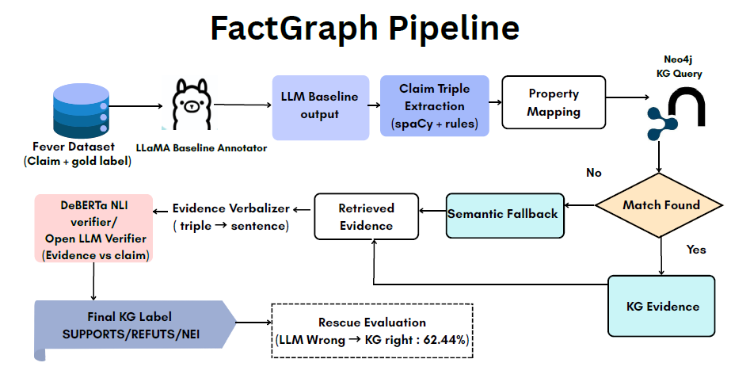

# FactGraph — Reducing Hallucinated LLM Annotations with Knowledge Graph Verification

> A Neo4j + Semantic Retrieval + NLI/LLM Verifier pipeline for FEVER claim labeling.  
> NLP Course Project · CSE 538 · Stony Brook University · May 2026

---

## The Problem

Consider this claim:

> *"The Titanic was directed by James Cameron."*

Ask a baseline LLM to label it:

```
Label: SUPPORTS   ✓ (happens to be correct)
Evidence: none
```

Now try this one:

> *"The Titanic was produced by Steven Spielberg."*

```
Label: SUPPORTS   ✗ (wrong — but stated with equal confidence)
Evidence: none
```

**This is the failure mode.** LLMs label claims from parametric memory — no retrieval, no evidence trail. When they're wrong, nothing flags it. At annotation scale, confidently wrong labels silently corrupt your dataset.

The task is straightforward: label factual claims as **SUPPORTS**, **REFUTES**, or **NOT ENOUGH INFO** — with grounding. The question FactGraph asks is:

> *Is the LLM's label backed by retrievable evidence, or just a guess?*

---

## The Smoking Gun

Before building anything, we ran a baseline LLM directly on FEVER claims. The numbers expose exactly why this matters:

| Metric | Baseline LLM |
|---|---|
| Overall accuracy | 57.14% |
| SUPPORTS recall | 0.79 |
| REFUTES recall | 0.82 |
| **NEI recall** | **0.17** |

The LLM correctly identified only **17% of "not enough info" cases**. On the other 83%, it picked a confident concrete label — SUPPORTS or REFUTES — with no evidence to back it up.

Silent overconfidence when evidence is missing. That's the exact failure mode FactGraph targets.

---

## The Fix: Add a KG Verification Layer

FactGraph sits between the LLM annotation and the final label. It independently verifies each claim using a Wikidata-derived knowledge graph, and corrects the LLM when the evidence says otherwise.



---

## Results

### System-level accuracy

| System | Accuracy | Key behavior |
|---|---|---|
| Baseline LLM | **57.14%** | Strong SUPPORTS/REFUTES, weak NEI |
| KG + LLM (strict) | 46.28% | Conservative, high NEI recall |
| KG + LLM (relaxed) | 48.29% | Less conservative |

### Per-class recall

| System | SUPPORTS | REFUTES | NEI |
|---|---|---|---|
| Baseline LLM | 0.79 | 0.82 | **0.17** |
| KG + LLM (strict) | 0.28 | 0.21 | **0.83** |
| KG + LLM (relaxed) | 0.38 | 0.48 | 0.57 |

### Hallucination rescue

The baseline LLM was wrong on **213 of 497** evaluation claims.  
The strict KG + LLM verifier corrected **133** of those errors:

```
Rescue Rate = 133 / 213 = 62.44%
```

The KG verifier trades raw accuracy for hallucination control — it's most valuable as a **second-stage correction layer**, not a standalone classifier.

---

## Knowledge Graph

Built from Wikidata facts for frequent FEVER entities:

| Step | Count |
|---|---|
| FEVER dev claims loaded | 19,998 |
| Entities appearing 5+ times | 936 |
| Entities matched on Wikidata | 700 |
| Wikidata facts fetched | 3,990 |
| KG-covered FEVER claims | 7,724 (38.6%) |

Properties fetched: date of birth, place of birth, country of citizenship, occupation, award received, country of origin, founded by, headquarters.

---

## Codebase

| File | Role |
|---|---|
| `build_kg_facts.py` | Extract frequent FEVER entities, fetch Wikidata facts |
| `load_kg.py` | Load into Neo4j |
| `extract_claims.py` | spaCy NER + dependency parsing → subject–relation–object triple |
| `query_kg.py` | Exact match and property-based retrieval from Neo4j |
| `sem_fallback.py` | Semantic fallback via sentence-transformers cosine similarity |
| `merge_for_nli.py` | Merge exact-match, KG-retrieve, and fallback evidence into one input file |
| `nli_verify.py` | DeBERTa NLI verification (entailment / contradiction / neutral) |
| `llm_verify.py` | Qwen 2.5-3B-Instruct verifier with strict and relaxed prompts |
| `evaluate_llm_verify.py` | Accuracy, classification report, hallucination rescue rate |

---

## Models Used

| Component | Model | Purpose |
|---|---|---|
| Baseline LLM annotator | LLaMA 3.1 | Generates the initial SUPPORTS / REFUTES / NOT_ENOUGH_INFO label without external evidence |
| Semantic property assist | `sentence-transformers/all-MiniLM-L6-v2` | Maps ambiguous claim relations to Wikidata-style properties during triple extraction |
| Semantic fallback retriever | `sentence-transformers/all-MiniLM-L6-v2` | Ranks subject-neighborhood KG triples by cosine similarity when exact KG matching fails |
| NLI verifier | `cross-encoder/nli-deberta-v3-small` | Compares verbalized KG evidence against the claim using entailment / contradiction / neutral |
| LLM verifier | `Qwen/Qwen2.5-3B-Instruct` | Performs evidence-grounded claim verification using strict and relaxed prompting |

**Other tools:** Neo4j (knowledge graph backend) · spaCy (NER + dependency parsing) · Wikidata API (fact source) · FEVER dev set (evaluation dataset)

---

## Future Work

- **Deeper fact coverage** — entity hit rate in the KG was ~80%+, but the bottleneck is fact-level coverage: an entity can be present in the graph without the specific property needed to verify a given claim. Fetching a broader set of Wikidata properties per entity would directly improve rescue rate.
- **Aliases and fuzzy entity linking** — surface form mismatches (e.g. "Spielberg" vs "Steven Spielberg") cause silent lookup failures. Adding alias resolution and fuzzy matching would reduce missed retrievals without changing the pipeline architecture.
- **Smarter LLM override decisions** — currently, weak or partial KG evidence and no evidence at all both result in NEI, which is why the strict verifier over-predicts it. A better verifier would distinguish between the two: if partial evidence exists but isn't conclusive, defer to the LLM's label rather than overriding it with NEI. The output label stays the same — the improvement is in knowing *when* the KG has enough ground to stand on to override the LLM at all.
- **Hybrid decision rules** — rather than choosing KG-only or LLM-only, the strongest system would use LLM flexibility when KG evidence is absent and let KG evidence override the LLM when a direct match exists.

---

*CSE 538 Natural Language Processing · Stony Brook University · 2026*
